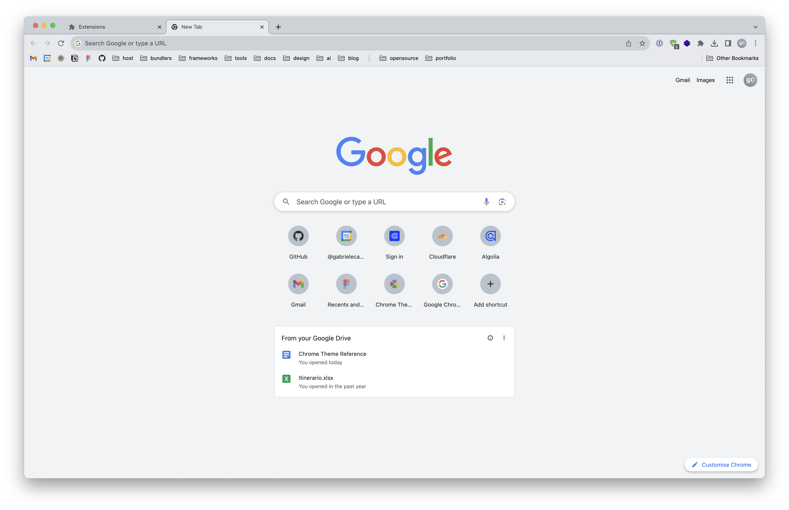
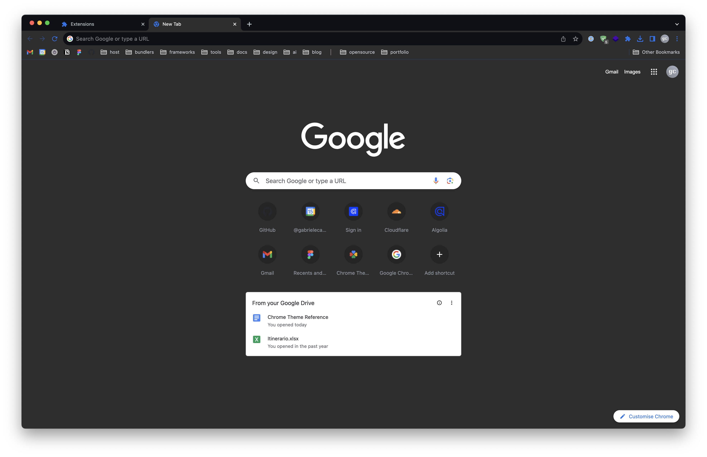
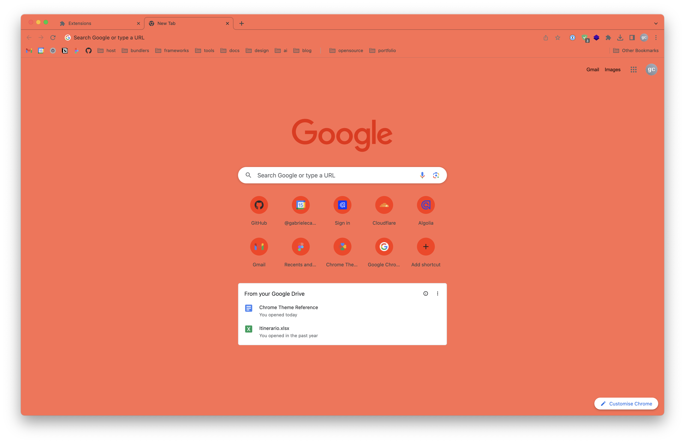
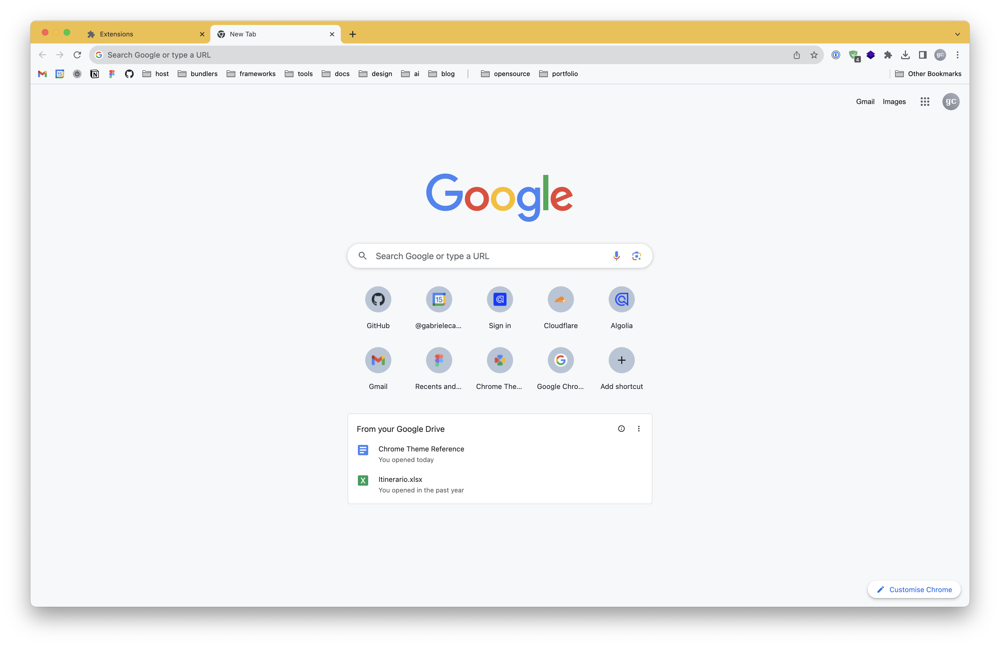

<h1>
  
  Chrome Themes
</h1>

Collection of tools and information to develop Chrome themes. Includes development instructions, a `manifest.json` template including all available options, a [JSON schema](#json-schema) for validation and editor support, references and ready-to-use [templates](#templates).

## Development

The file [`manifest.json`](manifest.json) at the root of this repo contains all available options for a theme. It can be downloaded directly from the repo or [here](https://gabrielecanepa.github.io/chrome-themes/manifest.json).

Quick reference:
- **`colors`** — Colors used by the theme in RGB array format, e.g. `[255, 0, 0]`. See the [colors reference](https://developer.chrome.com/docs/extensions/mv3/themes/#colors).
- **`images`** — Image resources use paths relative to the root of the extension. All images must be stored in PNG format or they will not render properly. See the [images reference](https://developer.chrome.com/docs/extensions/mv3/themes/#images).
- **`properties`** — Lets you specify properties such as background alignment, background repeat, and an alternate logo. See the [properties reference](https://developer.chrome.com/docs/extensions/mv3/themes/#properties).
- **`tints`** — Tints to be applied to parts of the UI such as buttons, the frame, and the background tab. Chrome supports tints because images don't work across platforms and are brittle with new buttons. Tints are in HSL format and use floating-point numbers in the range `0`–`1.0`, with `-1.0` specifying no change.

For more information, refer to the [official documentation](https://developer.chrome.com/docs/extensions/mv3/themes) and this [guide](https://docs.google.com/document/d/1jt9vdUY9O5IMm6Zoi2Kz0LWFfFZpvP69qjy6PoGsEoA).

## JSON Schema

A complete JSON schema for Chrome theme manifests is available [here](https://gabrielecanepa.github.io/chrome-themes/schema.json).

To enable validation and autocompletion in your editor, add it to the `$schema` field at the top of your `manifest.json`:

```json
{
  "$schema": "https://gabrielecanepa.github.io/chrome-themes/schema.json"
}
```

## Installing themes

Head over to `chrome://extensions` and enable developer mode, then click _Load unpacked_ and select the folder of the theme to install.

On every load, a `Cached Theme.pak` file will be created in the theme folder. This file is not needed for the theme to work, but it speeds up loading. To reflect new changes, delete this file and reload the extension.

## Templates

See the [templates](templates) folder for ready-to-use themes that can be used as a starting point for your own theme or as a reference for development.

### GitHub Light



```css
/* Color scheme */
--bgColor-frame: rgb(239, 242, 245);
--bgColor-omnibox: rgb(246, 248, 250);
--bgColor-toolbar: rgb(255, 255, 255);
--fgColor-default: rgb(36, 41, 46);
--fgColor-accent: rgb(9, 105, 218);
```

### GitHub Dark



```css
/* Color scheme */
--bgColor-frame: rgb(1, 4, 9);
--bgColor-omnibox: rgb(13, 17, 23);
--bgColor-toolbar: rgb(38, 42, 48);
--fgColor-default: rgb(240, 246, 252);
--fgColor-accent: rgb(68, 147, 248);
```

### Sienna



### Banana


